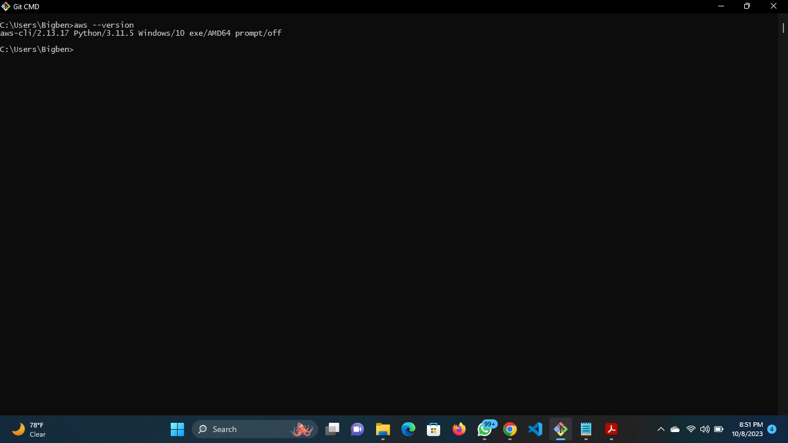

# How To Lunch AWS EC2 Instance Command Line Interface (CLI)

## Step 0: Prerequisities 
- Install The AWS Command Line Interface (CLI) If Not Already Installed On your Computer
- The AWS CLI can be downloaded from the AWS Official Website if not already installed on your Computer

## Step 1: Configure AWS CLI Using Your IAM Credentials:
- aws –version to confirm version installed
- aws configure to configure AWS CLI

.png>)

## Step 2: Create Key Pair
- When creating Key Pair use the Line Command: "aws ec2 create-key-pair --key-name <keypair-Name> --query 'KeyMaterial' –output text > keypair-Name.pem ”

.png>)

.png>)

## Step 3: Create Security group 
- When creating security groups use the Line Command: "aws ec2 create-security-group --group-name <security Group Name> --description "Description"" 

.png>)

.png>)

## Step 4: Add Inbound Rule
- To Add inbound rule use the Line Command: “aws ec2 authorize-security-group-ingress --group-id <security group Id> --protocol tcp --port <port Number> --cidr <ip address>”

.png>)

## Step 5: Launch Instance
- To Launch Instance use the Line Command: "aws ec2 run-instances --image-id <ami-Id> --count 1 --instance-type <type> --keyname <keypair-Name> --security-groups <security grp Name>"

.png>)

.png>)

.png>)

.png>)

## Step 6: View Running Instance
- To view the Details of the Running Instance use the Line Command:"aws ec2 describe-instances"

.png>)

.png>)

## Step 7: Terminate Running Instance
- To Terminate the Running Instance use the Line Command:"aws ec2 terminate-instances --instance-ids <Instance-Id> "

.png>)

.png>)

## Step 8: Delete Key Pair
- To Delete key pair of the Instance use the Line Command: "aws ec2 delete-key-pair --key-name <keypair-Name>"

.png>)

.png>)

## Step 9: Delete Security Group
- To Delete key pair of the Instance use the Line Command: "aws ec2 delete-security-group --group-name <security group Name>"

.png>)

.png>)

